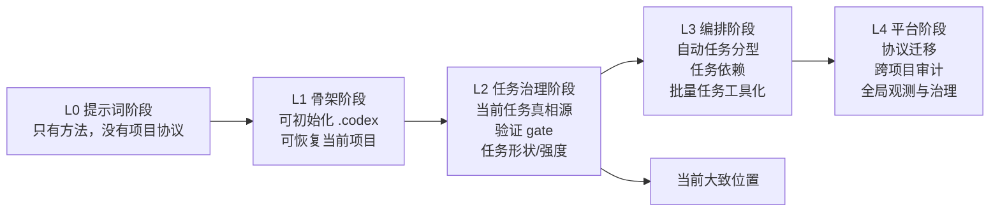

# Commander 能力成熟度路线图

更新时间：2026-04-17

这份文档回答两个问题：

1. 当前指挥官系统已经实现了哪些“驾驭工程”的能力；
2. 从当前阶段继续往前走，最值得优先补哪些能力。

## 1. 当前定性

当前 `ai-coding-commander` 已经不是单纯的提示词集合，而是一个**轻量工程治理系统**。

更准确地说，它当前大致位于：

- **L2：任务治理阶段**

还没有进入“重型编排平台”阶段，但已经稳定跨过：

- 只靠聊天推进
- 只靠 README 约定
- 没有项目内协议和恢复链

## 2. 能力成熟度分层



## 3. 已经比较完整实现的能力

以下能力已经是当前主线的一部分，可以视为“比较完整实现”：

### 3.1 主线 / 归档分层

- 活跃实现只认：
  - `skills/commander-mode/`
  - `skills/commander-mode/scripts/portable_harness.py`
  - `skills/commander-mode/scripts/bootstrap_codex_workspace.py`
- `legacy/agent-runtime/` 已明确降为归档参考，不再作为当前安装源、恢复入口或扩展目标。

### 3.2 已初始化 / 未初始化分流

- 进入一个项目时，先判断是否已经接入 `.codex` 协议；
- 未初始化项目进入半自动 bootstrap；
- 已初始化项目恢复当前项目自己的状态，而不是回到固定仓库语境。

### 3.3 通用 `.codex` 骨架 bootstrap

当前已经具备标准项目骨架：

- `AGENTS.md`
- `.codex/AGENT.md`
- `.codex/docs/当前状态.md`
- `.codex/docs/当前任务.md`
- `.codex/docs/恢复入口.md`
- `.codex/docs/验收记录.md`
- `.codex/docs/归档索引.md`
- `.codex/docs/协作偏好.md`
- `.codex/docs/周总结.md`

这意味着系统已经具备“先搭协议，再长血肉”的工程思路。

### 3.4 当前任务卡作为主任务真相源

当前系统已经明确：

- `当前任务.md` 是主任务真相源；
- 长任务恢复时优先看项目内文档，而不是聊天记忆；
- 任务推进、验证和下一步都围绕当前任务卡收口。

### 3.5 验证 gate

当前已经明确实现：

- 没有验证证据，不得标记任务完成。

这条规则已经进入：

- `commander-mode`
- 项目模板
- 相关测试

### 3.6 任务治理字段

当前任务模板已经支持：

- `当前任务形状：single / epic / batch / 待确认`
- `执行强度：compact / full / 待确认`
- `验证状态`
- `验证证据`

这说明系统已经开始表达任务复杂度，而不是只记录一条待办。

### 3.7 可分享 / 可安装

当前已经支持两条外部分发路径：

1. 开发者路径
   - 复制目录或 junction 暴露 `skills/commander-mode/`
2. 普通用户路径
   - `install/install-commander.ps1`

这说明当前 commander 已经具备基础产品化能力。

### 3.8 测试兜底

当前主线已经有测试覆盖：

- `tests/test_portable_harness.py`
- `tests/test_project_codex_bootstrap.py`
- `tests/test_install_commander.py`

说明现有协议不是纯文档约定，而是有行为验证的。

## 4. 部分实现但还不够强的能力

### 4.1 Batch 任务协议

当前已经有轻量扩展入口：

```text
.codex/
  batch/
    <task-name>/
      BATCH.md
      workers-input.csv
      workers-output.csv
```

但它目前仍然偏协议层，缺少更强的工具化支持。

### 4.2 Epic 任务表达

现在已经有 `epic` 这个任务形状概念，但还没有形成成熟的：

- 子任务依赖表达
- 阶段推进
- 自动收口

### 4.3 执行强度治理

`compact / full` 已经进入模板，但还没有真正驱动不同的流程深度。

### 4.4 条件化恢复

当前已经支持：

- 当任务形状为 `batch` 时，恢复时继续看 `.codex/batch/`

但还没有形成一套系统化的“不同任务形状，对应不同恢复深度”的规则。

## 5. 还没有实现的关键能力

### 5.1 自动任务分型

当前系统还不会自动稳定判断：

- 这是 `single`
- 这是 `epic`
- 这是 `batch`

目前仍然主要依赖人工确认。

### 5.2 自动任务类型判定

当前系统也不会自动稳定判断：

- 当前任务是开发
- 修复
- 重构
- 文档
- 评审整改

目前仍以项目自己填写的当前任务为主。

### 5.3 更强的计划执行闭环

当前已经有：

- 计划文档
- 当前任务卡
- 验证 gate

但还没有形成更强的统一闭环：

- 计划生成
- 执行分派
- 结果回收
- 验收归档

### 5.4 更强的 stop-gate

当前只有轻量 gate。

还没有做到：

- 按风险等级切换 gate 强度
- 按任务形状自动升级验证要求
- 在高风险任务上强制更重的停点

### 5.5 `.codex` 协议版本迁移

当前模板已经在演进，但还没有：

- schema version
- migration 规则
- 老项目升级路径

### 5.6 跨项目观测 / 审计

当前每个项目可以自洽，但还没有：

- 哪些项目已经初始化
- 哪些项目长期未审计
- 哪些项目状态过期
- 哪些项目协议版本落后

的全局视角。

## 6. 当前阶段的工程判断

如果按工程成熟度来定性：

### 当前已经达到

- **轻量工程治理系统**

能够驾驭：

- 新项目接入
- 项目状态恢复
- 当前任务治理
- 基本质量门
- 基本分发安装

### 当前还没有达到

- **强编排、强治理、强观测的平台级系统**

## 7. `L2 -> L3` 建议实施顺序

从当前状态往前走，最划算的顺序建议是：

### 第一阶段：先补最值钱的治理增强

1. **自动任务分型**
   - 至少能辅助判断 `single / epic / batch`
2. **epic 轻量子任务依赖**
   - 先支持轻量依赖表达，不急着引入重型 runtime
3. **batch 工具化**
   - 为 `.codex/batch/` 补最小工具，而不是只停留在目录协议

### 第二阶段：让字段真正驱动流程

4. **执行强度驱动流程**
   - `compact` 和 `full` 不只是记录字段，而是改变恢复深度、验证深度和收口要求
5. **恢复深度分层**
   - `single` 恢复浅一些
   - `epic / batch` 恢复深一些

### 第三阶段：再考虑平台层能力

6. **协议版本迁移**
7. **跨项目审计 / 全局观测**

## 8. 当前建议

基于当前仓库的真实状态，建议把下一轮主线聚焦在：

1. 自动任务分型
2. epic 轻量依赖表达
3. batch 最小工具化

原因：

- 这三项最贴当前 commander 已有结构；
- 能明显把系统从“能管任务”推进到“开始编排任务”；
- 不需要立即把系统升级成重平台。

## 9. 一句话总结

当前 `ai-coding-commander` 已经具备一套可初始化、可恢复、可治理、可验证、可分享的轻量工程协议。

它已经能驾驭工程，但更准确地说，**它现在是“轻量工程治理系统”，还不是“重型工程编排平台”。**
